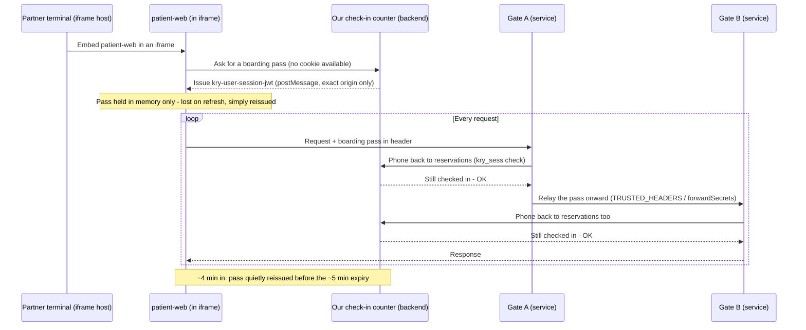

# Mermaid Sequence Diagram Rendering Implementation Plan

> **For agentic workers:** REQUIRED SUB-SKILL: Use superpowers:subagent-driven-development (recommended) or superpowers:executing-plans to implement this plan task-by-task. Steps use checkbox (`- [ ]`) syntax for tracking.

**Goal:** Fix Mermaid `sequenceDiagram` code blocks rendering as scrambled one-word boxes (they're currently fed to the flowchart-only parser) by adding a real sequence-diagram renderer, per `docs/superpowers/specs/2026-08-07-sequence-diagrams-design.md`.

**Architecture:** Split `src/diagram.rs` into `src/diagram/{mod.rs, flowchart.rs}` so the shared ASCII-canvas primitives (`mod.rs`) are separate from flowchart-only parsing/layout/rendering (`flowchart.rs`). Add `src/diagram/sequence.rs` with its own parser, single-pass top-to-bottom layout, and renderer (reusing `mod.rs`'s `Canvas`). `mod.rs`'s public `render_mermaid()` inspects the code block's header line and dispatches to `sequence::render_sequence` or `flowchart::render_flowchart`.

**Tech Stack:** Rust 2024 (rustc 1.85+), `crossterm::style::Color` for terminal colors, no new crate dependencies.

## Global Constraints

- No Rust toolchain may be available in the sandbox. Check `cargo --version` first; if absent, use `docker run --rm -v "$PWD":/w -w /w rust:1-slim <cargo subcommand>` for every build/test/fmt/clippy step below (clear `target/` first if you hit a stale-incremental-compilation error switching between host/Docker toolchains).
- The flowchart renderer's behavior must not change. Every task that touches `diagram.rs`/`flowchart.rs` must leave `graph`/`flowchart` Mermaid blocks rendering identically to today.
- Unsupported or unrecognized syntax inside a `sequenceDiagram` block (blank lines, `%%` comments, `autonumber`, `title`, anything not explicitly parsed) must be silently skipped — never fall through to generic parsing. This is the actual bug being fixed; regressing it recreates the garbled-box bug for different input.
- Match existing code style: 4-space indent, `pub(crate)` for cross-module-within-`diagram`-visibility, doc comments only where the *why* isn't obvious.
- `json.rs`'s `use crate::diagram::{Canvas, CardDrawRow};` (its only external dependency on this module) must keep working unchanged throughout the split.

---

### Task 1: Baseline characterization tests for the flowchart renderer

**Files:**
- Modify: `src/diagram.rs` (append a `#[cfg(test)] mod tests` block at the end, after line 1136)

**Interfaces:**
- Produces: nothing new consumed by later tasks — this is a safety net proving today's flowchart behavior, so Task 2's pure file-split can be verified not to have changed it.

`src/diagram.rs` currently has zero tests (unlike every other module in this crate). Add some before moving any code.

- [ ] **Step 1: Write the tests**

Append to the end of `src/diagram.rs`:

```rust
#[cfg(test)]
mod tests {
    use super::*;
    use crate::theme::Theme;

    fn flatten(rows: &[Vec<StyledSpan>]) -> String {
        rows.iter()
            .map(|row| row.iter().map(|s| s.text.as_str()).collect::<String>())
            .collect::<Vec<_>>()
            .join("\n")
    }

    #[test]
    fn renders_simple_top_down_flowchart() {
        let theme = Theme::dark();
        let (rows, width) =
            render_mermaid("graph TD\nA[Start] --> B[End]", &theme).expect("flowchart should render");
        let text = flatten(&rows);
        assert!(text.contains("Start"), "expected 'Start' node in:\n{text}");
        assert!(text.contains("End"), "expected 'End' node in:\n{text}");
        assert!(width > 0);
    }

    #[test]
    fn renders_left_right_flowchart_with_edge_label() {
        let theme = Theme::dark();
        let (rows, _width) = render_mermaid("graph LR\nA[One] -- go --> B[Two]", &theme)
            .expect("flowchart should render");
        let text = flatten(&rows);
        assert!(text.contains("One"), "expected 'One' node in:\n{text}");
        assert!(text.contains("Two"), "expected 'Two' node in:\n{text}");
        assert!(text.contains("go"), "expected edge label 'go' in:\n{text}");
    }

    #[test]
    fn renders_diamond_and_circle_shapes() {
        let theme = Theme::dark();
        let (rows, _width) =
            render_mermaid("graph TD\nA{Decision} --> B((Circle))", &theme).expect("should render");
        let text = flatten(&rows);
        assert!(text.contains("Decision"));
        assert!(text.contains("Circle"));
        assert!(text.contains('◆'), "diamond shape should use ◆ border chars");
    }

    #[test]
    fn unparseable_input_returns_none() {
        let theme = Theme::dark();
        assert!(render_mermaid("not a mermaid diagram at all", &theme).is_none());
    }

    #[test]
    fn empty_code_block_returns_none() {
        let theme = Theme::dark();
        assert!(render_mermaid("", &theme).is_none());
    }
}
```

- [ ] **Step 2: Run tests to verify they pass**

Run: `cargo test --lib diagram:: 2>&1 | tail -30`
Expected: PASS — all 5 new `diagram::tests::*` tests green (this is a characterization test of existing behavior, not new behavior, so there is no "verify it fails first" step here).

- [ ] **Step 3: Commit**

```bash
git add src/diagram.rs
git commit -m "test(diagram): add baseline characterization tests for flowchart rendering"
```

---

### Task 2: Split `diagram.rs` into `src/diagram/{mod.rs, flowchart.rs}`

**Files:**
- Create: `src/diagram/mod.rs`
- Create: `src/diagram/flowchart.rs` (via `git mv` of `src/diagram.rs`, then edited)
- Delete: `src/diagram.rs` (accomplished by the `git mv` above — nothing left at the old path)

**Interfaces:**
- Produces: `crate::diagram::{Canvas, CanvasCell, NodeShape, CardDrawRow, CONN_UP, CONN_DOWN, CONN_LEFT, CONN_RIGHT, junction_char}` (all `pub(crate)`, unchanged names/signatures — `json.rs`'s existing `use crate::diagram::{Canvas, CardDrawRow};` keeps compiling with no changes there). `crate::diagram::render_mermaid` (unchanged public signature). `flowchart::render_flowchart(code: &str, theme: &Theme) -> Option<(Vec<Vec<StyledSpan>>, usize)>` — `pub(crate)`, used only by `mod.rs`'s dispatcher; used by Task 3 as the "not a sequence diagram" fallback branch.
- Consumes: nothing new.

This task moves code with **no behavior change** — Task 1's tests must still pass afterward, unmodified in assertions (only their `render_mermaid(...)` call sites need to compile, which they already do since `render_mermaid` stays defined in `mod.rs` with the same signature).

- [ ] **Step 1: Move the file**

```bash
mkdir -p src/diagram
git mv src/diagram.rs src/diagram/flowchart.rs
```

- [ ] **Step 2: Create `src/diagram/mod.rs`**

This file holds everything that isn't flowchart-specific: `NodeShape` (shared with the sequence renderer, added in Task 3), `CardDrawRow`/`Canvas`/`CanvasCell` (the shared ASCII-canvas primitives, also used by `json.rs`), and the public dispatcher.

```rust
use crate::style::{Style, StyledSpan};
use crate::theme::Theme;
use crossterm::style::Color;
use std::collections::HashSet;

mod flowchart;

// ───── Shared shape/card types ─────

#[derive(Debug, Clone, Copy, PartialEq)]
pub(crate) enum NodeShape {
    Rectangle,
    Rounded,
    Diamond,
    Circle,
}

/// A row to be drawn inside a multi-row card node.
pub(crate) struct CardDrawRow {
    pub key: String,
    pub value_text: String,
    pub value_color: Option<Color>,
    /// If true, the value area shows `──▶` instead of text.
    pub is_connector: bool,
}

// ───── Canvas ─────

pub(crate) const CONN_UP: u8 = 1;
pub(crate) const CONN_DOWN: u8 = 2;
pub(crate) const CONN_LEFT: u8 = 4;
pub(crate) const CONN_RIGHT: u8 = 8;

pub(crate) fn junction_char(connects: u8) -> char {
    match connects {
        c if c == CONN_UP | CONN_DOWN => '│',
        c if c == CONN_LEFT | CONN_RIGHT => '─',
        c if c == CONN_DOWN | CONN_RIGHT => '┌',
        c if c == CONN_DOWN | CONN_LEFT => '┐',
        c if c == CONN_UP | CONN_RIGHT => '└',
        c if c == CONN_UP | CONN_LEFT => '┘',
        c if c == CONN_UP | CONN_DOWN | CONN_RIGHT => '├',
        c if c == CONN_UP | CONN_DOWN | CONN_LEFT => '┤',
        c if c == CONN_DOWN | CONN_LEFT | CONN_RIGHT => '┬',
        c if c == CONN_UP | CONN_LEFT | CONN_RIGHT => '┴',
        c if c == CONN_UP | CONN_DOWN | CONN_LEFT | CONN_RIGHT => '┼',
        c if c == CONN_UP => '│',
        c if c == CONN_DOWN => '│',
        c if c == CONN_LEFT => '─',
        c if c == CONN_RIGHT => '─',
        _ => '·',
    }
}

#[derive(Clone)]
pub(crate) struct CanvasCell {
    pub(crate) ch: char,
    pub(crate) fg: Option<Color>,
    pub(crate) bg: Option<Color>,
    pub(crate) is_node: bool,
    pub(crate) connects: u8,
}

impl Default for CanvasCell {
    fn default() -> Self {
        Self {
            ch: ' ',
            fg: None,
            bg: None,
            is_node: false,
            connects: 0,
        }
    }
}

pub(crate) struct Canvas {
    pub(crate) width: usize,
    pub(crate) height: usize,
    cells: Vec<Vec<CanvasCell>>,
}

impl Canvas {
    pub(crate) fn new(width: usize, height: usize) -> Self {
        Self {
            width,
            height,
            cells: vec![vec![CanvasCell::default(); width]; height],
        }
    }

    pub(crate) fn set(&mut self, x: usize, y: usize, ch: char, fg: Option<Color>) {
        if y < self.height && x < self.width {
            self.cells[y][x].ch = ch;
            self.cells[y][x].fg = fg;
        }
    }

    pub(crate) fn set_node(&mut self, x: usize, y: usize, ch: char, fg: Option<Color>) {
        if y < self.height && x < self.width {
            self.cells[y][x].ch = ch;
            self.cells[y][x].fg = fg;
            self.cells[y][x].is_node = true;
        }
    }

    pub(crate) fn add_connection(&mut self, x: usize, y: usize, dir: u8, fg: Option<Color>) {
        if y < self.height && x < self.width {
            let cell = &mut self.cells[y][x];
            if !cell.is_node {
                cell.connects |= dir;
                cell.ch = junction_char(cell.connects);
                if fg.is_some() {
                    cell.fg = fg;
                }
            }
        }
    }

    #[allow(clippy::too_many_arguments)]
    pub(crate) fn draw_node(
        &mut self,
        cx: usize,
        y: usize,
        width: usize,
        label: &str,
        shape: NodeShape,
        border_fg: Option<Color>,
        text_fg: Option<Color>,
    ) {
        let x = cx.saturating_sub(width / 2);

        let (tl, tr, bl, br, h, v) = match shape {
            NodeShape::Rectangle => ('┌', '┐', '└', '┘', '─', '│'),
            NodeShape::Rounded | NodeShape::Circle => ('╭', '╮', '╰', '╯', '─', '│'),
            NodeShape::Diamond => ('◆', '◆', '◆', '◆', '─', '│'),
        };

        // Top border
        self.set_node(x, y, tl, border_fg);
        for i in 1..width - 1 {
            self.set_node(x + i, y, h, border_fg);
        }
        self.set_node(x + width - 1, y, tr, border_fg);

        // Content line
        self.set_node(x, y + 1, v, border_fg);
        for i in 1..width - 1 {
            self.set_node(x + i, y + 1, ' ', text_fg);
        }
        let label_chars: Vec<char> = label.chars().collect();
        let padding = (width - 2).saturating_sub(label_chars.len());
        let left_pad = padding / 2;
        for (i, &ch) in label_chars.iter().enumerate() {
            if x + 1 + left_pad + i < x + width - 1 {
                self.set_node(x + 1 + left_pad + i, y + 1, ch, text_fg);
            }
        }
        self.set_node(x + width - 1, y + 1, v, border_fg);

        // Bottom border
        self.set_node(x, y + 2, bl, border_fg);
        for i in 1..width - 1 {
            self.set_node(x + i, y + 2, h, border_fg);
        }
        self.set_node(x + width - 1, y + 2, br, border_fg);
    }

    fn set_node_bg(&mut self, x: usize, y: usize, ch: char, fg: Option<Color>, bg: Option<Color>) {
        if y < self.height && x < self.width {
            self.cells[y][x].ch = ch;
            self.cells[y][x].fg = fg;
            self.cells[y][x].bg = bg;
            self.cells[y][x].is_node = true;
        }
    }

    /// Draw a multi-row card (table-like node) used by the JSON graph view.
    /// Returns the y-coordinate of each content row for edge routing.
    #[allow(clippy::too_many_arguments)]
    pub(crate) fn draw_card(
        &mut self,
        left_x: usize,
        top_y: usize,
        width: usize,
        title: &str,
        rows: &[CardDrawRow],
        border_fg: Option<Color>,
        title_fg: Option<Color>,
        key_fg: Option<Color>,
        highlight_rows: &HashSet<usize>,
        highlight_fg: Option<Color>,
        card_highlight_bg: Option<Color>,
    ) -> Vec<usize> {
        if width < 4 {
            return Vec::new();
        }
        let inner = width - 2; // space between │ and │
        let bg = card_highlight_bg;

        // ── top border with title: ╭─ title ─────╮ ──
        self.set_node_bg(left_x, top_y, '╭', border_fg, bg);
        self.set_node_bg(left_x + 1, top_y, '─', border_fg, bg);
        let title_chars: Vec<char> = title.chars().collect();
        let max_title = inner.saturating_sub(3); // "─" + space on each side
        let show_title = title_chars.len().min(max_title);
        self.set_node_bg(left_x + 2, top_y, ' ', title_fg, bg);
        for (i, &ch) in title_chars[..show_title].iter().enumerate() {
            self.set_node_bg(left_x + 3 + i, top_y, ch, title_fg, bg);
        }
        let fill_start = left_x + 3 + show_title;
        self.set_node_bg(fill_start, top_y, ' ', border_fg, bg);
        for x in (fill_start + 1)..(left_x + width - 1) {
            self.set_node_bg(x, top_y, '─', border_fg, bg);
        }
        self.set_node_bg(left_x + width - 1, top_y, '╮', border_fg, bg);

        // ── content rows ──
        let key_col_width = rows
            .iter()
            .map(|r| r.key.chars().count())
            .max()
            .unwrap_or(0)
            .min(inner.saturating_sub(4));

        let mut row_ys = Vec::with_capacity(rows.len());
        for (ri, row) in rows.iter().enumerate() {
            let y = top_y + 1 + ri;
            row_ys.push(y);

            let is_highlight = highlight_rows.contains(&ri);
            let row_key_fg = if is_highlight { highlight_fg } else { key_fg };
            let row_val_fg = if is_highlight {
                highlight_fg
            } else {
                row.value_color
            };

            // left border
            self.set_node_bg(left_x, y, '│', border_fg, bg);

            // space after border
            self.set_node_bg(left_x + 1, y, ' ', row_key_fg, bg);

            // key text
            let key_chars: Vec<char> = row.key.chars().collect();
            let show_key = key_chars.len().min(key_col_width);
            for (i, &ch) in key_chars[..show_key].iter().enumerate() {
                self.set_node_bg(left_x + 2 + i, y, ch, row_key_fg, bg);
            }
            // pad key column
            for i in show_key..key_col_width {
                self.set_node_bg(left_x + 2 + i, y, ' ', row_key_fg, bg);
            }

            // gap between key and value
            let val_start = left_x + 2 + key_col_width + 1;
            self.set_node_bg(val_start - 1, y, ' ', row_val_fg, bg);

            // value text (fill remaining space)
            let val_space = (left_x + width - 1).saturating_sub(val_start + 1);
            if row.is_connector {
                // draw ──▶ at the right edge of the card
                for x in val_start..(left_x + width - 1) {
                    self.set_node_bg(x, y, ' ', row_val_fg, bg);
                }
                // put the arrow near the right border
                let arrow_start = (left_x + width - 1).saturating_sub(4);
                if arrow_start >= val_start {
                    self.set_node_bg(arrow_start, y, '─', row_val_fg, bg);
                    self.set_node_bg(arrow_start + 1, y, '─', row_val_fg, bg);
                    self.set_node_bg(arrow_start + 2, y, '▶', row_val_fg, bg);
                }
            } else {
                let val_chars: Vec<char> = row.value_text.chars().collect();
                let show_val = val_chars.len().min(val_space);
                for (i, &ch) in val_chars[..show_val].iter().enumerate() {
                    self.set_node_bg(val_start + i, y, ch, row_val_fg, bg);
                }
                // pad remaining
                for i in show_val..val_space {
                    self.set_node_bg(val_start + i, y, ' ', row_val_fg, bg);
                }
            }

            // space before right border
            self.set_node_bg(left_x + width - 2, y, ' ', border_fg, bg);
            // right border
            self.set_node_bg(left_x + width - 1, y, '│', border_fg, bg);
        }

        // ── bottom border: ╰─────────╯ ──
        let bot_y = top_y + 1 + rows.len();
        self.set_node_bg(left_x, bot_y, '╰', border_fg, bg);
        for x in (left_x + 1)..(left_x + width - 1) {
            self.set_node_bg(x, bot_y, '─', border_fg, bg);
        }
        self.set_node_bg(left_x + width - 1, bot_y, '╯', border_fg, bg);

        row_ys
    }

    #[allow(clippy::too_many_arguments)]
    pub(crate) fn draw_edge_td(
        &mut self,
        src_cx: usize,
        src_bottom_y: usize,
        dst_cx: usize,
        dst_top_y: usize,
        label: Option<&str>,
        edge_fg: Option<Color>,
        label_fg: Option<Color>,
    ) {
        if src_bottom_y + 1 >= dst_top_y {
            return;
        }

        let mid_y = src_bottom_y + 1 + (dst_top_y - src_bottom_y - 1) / 2;

        if src_cx == dst_cx {
            // Straight down
            for y in (src_bottom_y + 1)..dst_top_y {
                self.add_connection(src_cx, y, CONN_UP | CONN_DOWN, edge_fg);
            }
            // Arrow replaces last segment
            self.set(dst_cx, dst_top_y - 1, '▼', edge_fg);

            // Place label beside the vertical line
            if let Some(text) = label {
                let label_y = src_bottom_y + 1;
                for (i, ch) in text.chars().enumerate() {
                    self.set(src_cx + 2 + i, label_y, ch, label_fg);
                }
            }
        } else {
            // Down from source to mid_y
            for y in (src_bottom_y + 1)..mid_y {
                self.add_connection(src_cx, y, CONN_UP | CONN_DOWN, edge_fg);
            }

            // Junction at source column, mid_y
            let src_turn = if dst_cx > src_cx {
                CONN_UP | CONN_RIGHT
            } else {
                CONN_UP | CONN_LEFT
            };
            self.add_connection(src_cx, mid_y, src_turn, edge_fg);

            // Horizontal segment
            let (min_x, max_x) = if src_cx < dst_cx {
                (src_cx, dst_cx)
            } else {
                (dst_cx, src_cx)
            };
            for x in (min_x + 1)..max_x {
                self.add_connection(x, mid_y, CONN_LEFT | CONN_RIGHT, edge_fg);
            }

            // Junction at destination column, mid_y
            let dst_turn = if dst_cx > src_cx {
                CONN_LEFT | CONN_DOWN
            } else {
                CONN_RIGHT | CONN_DOWN
            };
            self.add_connection(dst_cx, mid_y, dst_turn, edge_fg);

            // Down from mid_y to destination
            for y in (mid_y + 1)..dst_top_y {
                self.add_connection(dst_cx, y, CONN_UP | CONN_DOWN, edge_fg);
            }

            // Arrow
            self.set(dst_cx, dst_top_y - 1, '▼', edge_fg);

            // Place label above horizontal segment
            if let Some(text) = label {
                let label_len = text.chars().count();
                let label_start = min_x + (max_x - min_x).saturating_sub(label_len) / 2;
                let label_y = if mid_y > 0 { mid_y - 1 } else { mid_y };
                for (i, ch) in text.chars().enumerate() {
                    let lx = label_start + i;
                    if lx < self.width {
                        self.set(lx, label_y, ch, label_fg);
                    }
                }
            }
        }
    }

    #[allow(clippy::too_many_arguments)]
    pub(crate) fn draw_edge_lr(
        &mut self,
        _src_cx: usize,
        src_right_x: usize,
        src_cy: usize,
        dst_left_x: usize,
        dst_cy: usize,
        label: Option<&str>,
        edge_fg: Option<Color>,
        label_fg: Option<Color>,
        mid_x_override: Option<usize>,
    ) {
        if src_right_x + 1 >= dst_left_x {
            return;
        }

        let mid_x =
            mid_x_override.unwrap_or_else(|| src_right_x + 1 + (dst_left_x - src_right_x - 1) / 2);

        if src_cy == dst_cy {
            // Straight right
            for x in (src_right_x + 1)..dst_left_x {
                self.add_connection(x, src_cy, CONN_LEFT | CONN_RIGHT, edge_fg);
            }
            // Arrow replaces last segment
            self.set(dst_left_x - 1, dst_cy, '▶', edge_fg);

            // Label above the horizontal line
            if let Some(text) = label {
                let label_x = src_right_x + 2;
                let label_y = if src_cy > 0 { src_cy - 1 } else { 0 };
                for (i, ch) in text.chars().enumerate() {
                    self.set(label_x + i, label_y, ch, label_fg);
                }
            }
        } else {
            // Right from source to mid_x
            for x in (src_right_x + 1)..mid_x {
                self.add_connection(x, src_cy, CONN_LEFT | CONN_RIGHT, edge_fg);
            }

            // Junction at mid_x, source row
            let src_turn = if dst_cy > src_cy {
                CONN_LEFT | CONN_DOWN
            } else {
                CONN_LEFT | CONN_UP
            };
            self.add_connection(mid_x, src_cy, src_turn, edge_fg);

            // Vertical segment
            let (min_y, max_y) = if src_cy < dst_cy {
                (src_cy, dst_cy)
            } else {
                (dst_cy, src_cy)
            };
            for y in (min_y + 1)..max_y {
                self.add_connection(mid_x, y, CONN_UP | CONN_DOWN, edge_fg);
            }

            // Junction at mid_x, destination row
            let dst_turn = if dst_cy > src_cy {
                CONN_UP | CONN_RIGHT
            } else {
                CONN_DOWN | CONN_RIGHT
            };
            self.add_connection(mid_x, dst_cy, dst_turn, edge_fg);

            // Right from mid_x to destination
            for x in (mid_x + 1)..dst_left_x {
                self.add_connection(x, dst_cy, CONN_LEFT | CONN_RIGHT, edge_fg);
            }

            // Arrow
            self.set(dst_left_x - 1, dst_cy, '▶', edge_fg);

            // Label near the vertical segment
            if let Some(text) = label {
                let label_y = min_y + (max_y - min_y).saturating_sub(1) / 2;
                for (i, ch) in text.chars().enumerate() {
                    self.set(mid_x + 2 + i, label_y, ch, label_fg);
                }
            }
        }
    }

    pub(crate) fn to_span_rows(&self, theme: &Theme) -> Vec<Vec<StyledSpan>> {
        let default_bg = Some(theme.code_bg);
        self.cells
            .iter()
            .map(|row| {
                let mut spans = Vec::new();
                let mut i = 0;
                while i < row.len() {
                    let fg = row[i].fg.unwrap_or(theme.fg);
                    let cell_bg = row[i].bg.or(default_bg);
                    let mut text = String::new();
                    let mut j = i;
                    while j < row.len()
                        && row[j].fg.unwrap_or(theme.fg) == fg
                        && row[j].bg.or(default_bg) == cell_bg
                    {
                        text.push(row[j].ch);
                        j += 1;
                    }
                    spans.push(StyledSpan {
                        text,
                        style: Style {
                            fg: Some(fg),
                            bg: cell_bg,
                            ..Default::default()
                        },
                    });
                    i = j;
                }
                spans
            })
            .collect()
    }
}

// ───── Public API ─────

/// Try to render mermaid code as a visual diagram.
/// Returns (content_rows, content_width) or None if parsing fails.
pub fn render_mermaid(code: &str, theme: &Theme) -> Option<(Vec<Vec<StyledSpan>>, usize)> {
    flowchart::render_flowchart(code, theme)
}
```

- [ ] **Step 3: Edit `src/diagram/flowchart.rs`**

Replace the file's leading imports (the original `use crate::style::{Style, StyledSpan};` / `use crate::theme::Theme;` / `use crossterm::style::Color;` / `use std::collections::{HashMap, HashSet, VecDeque};` block) with:

```rust
use crate::style::StyledSpan;
use crate::theme::Theme;
use std::collections::{HashMap, VecDeque};

use super::{Canvas, NodeShape};
```

Delete the `NodeShape` enum definition (it now comes from `super`):

```rust
#[derive(Debug, Clone, Copy, PartialEq)]
pub(crate) enum NodeShape {
    Rectangle,
    Rounded,
    Diamond,
    Circle,
}
```

Delete the `CardDrawRow` struct (moved to `mod.rs`):

```rust
/// A row to be drawn inside a multi-row card node.
pub(crate) struct CardDrawRow {
    pub key: String,
    pub value_text: String,
    pub value_color: Option<Color>,
    /// If true, the value area shows `──▶` instead of text.
    pub is_connector: bool,
}
```

Delete the entire Canvas section (from the `// ───── Canvas ─────` comment through the end of `impl Canvas { ... to_span_rows ... }`, i.e. everything from `pub(crate) const CONN_UP: u8 = 1;` through the closing `}` of `to_span_rows`'s enclosing `impl Canvas` block) — all of it moved verbatim to `mod.rs` in Step 2.

Rename `parse_mermaid` to `parse_flowchart` (its one call site is inside the dispatcher, updated below):

```rust
fn parse_flowchart(code: &str) -> Option<Graph> {
```

Replace the final dispatcher function:

```rust
pub fn render_mermaid(code: &str, theme: &Theme) -> Option<(Vec<Vec<StyledSpan>>, usize)> {
    let graph = parse_mermaid(code)?;
    match graph.direction {
        Direction::TopDown => render_td(&graph, theme),
        Direction::LeftRight => render_lr(&graph, theme),
    }
}
```

with:

```rust
pub(crate) fn render_flowchart(code: &str, theme: &Theme) -> Option<(Vec<Vec<StyledSpan>>, usize)> {
    let graph = parse_flowchart(code)?;
    match graph.direction {
        Direction::TopDown => render_td(&graph, theme),
        Direction::LeftRight => render_lr(&graph, theme),
    }
}
```

Everything else in `flowchart.rs` (`Direction`, `Node`, `Edge`, `Graph`, `parse_node_ref`, `find_matching`, `register_node`, `parse_line`, `parse_arrow`, `NodeLayout`, `assign_layers`, `order_within_layers`, `node_box_width`, `label_box_width`, `render_td`, `render_lr`) stays exactly as it was.

Finally, in the `#[cfg(test)] mod tests` block added in Task 1 (now at the bottom of this file), update the two call sites that construct via the dispatcher — `render_mermaid(...)` → `render_flowchart(...)`:

```rust
    #[test]
    fn renders_simple_top_down_flowchart() {
        let theme = Theme::dark();
        let (rows, width) = render_flowchart("graph TD\nA[Start] --> B[End]", &theme)
            .expect("flowchart should render");
        // ... rest of the test body is unchanged ...
```

Apply the same `render_mermaid(` → `render_flowchart(` rename to the other 4 tests in that module (`renders_left_right_flowchart_with_edge_label`, `renders_diamond_and_circle_shapes`, `unparseable_input_returns_none`, `empty_code_block_returns_none`).

- [ ] **Step 4: Build and run tests**

Run: `cargo build 2>&1 | tail -60`
Expected: builds cleanly. If you see "unresolved import" or "cannot find type `NodeShape`" errors, double check Step 3's import block was added and the deleted `NodeShape`/`CardDrawRow`/Canvas-section text was removed in full (not partially).

Run: `cargo test --lib diagram:: 2>&1 | tail -40`
Expected: PASS — all 5 tests from Task 1 still green, now running against `flowchart::render_flowchart` through the renamed call sites, dispatched via `mod.rs`'s `render_mermaid`.

Run: `cargo test 2>&1 | tail -60`
Expected: PASS — the full suite, including `json::` (confirms `use crate::diagram::{Canvas, CardDrawRow};` still resolves).

- [ ] **Step 5: Commit**

```bash
git add -A src/diagram.rs src/diagram/
git commit -m "refactor(diagram): split diagram.rs into mod.rs (shared canvas) + flowchart.rs"
```

---

### Task 3: Sequence diagram parser + dispatcher wiring

**Files:**
- Create: `src/diagram/sequence.rs`
- Modify: `src/diagram/mod.rs` (add `mod sequence;` and header-based dispatch)

**Interfaces:**
- Produces: `sequence::{Participant, LineStyle, ArrowEnd, Message, NoteTarget, Note, BlockSection, Block, Event, SequenceDiagram}` (all `pub(crate)`, used by Task 4's layout code) and `sequence::parse_sequence(code: &str) -> Option<SequenceDiagram>` (used by Task 4/5). `sequence::render_sequence(code: &str, theme: &Theme) -> Option<(Vec<Vec<StyledSpan>>, usize)>` — `pub(crate)`, called by `mod.rs`'s dispatcher; for this task it always returns `None` (layout/rendering land in Task 5), so a `sequenceDiagram` block falls back to the plain syntax-highlighted code block instead of flowchart garbage — already a correct, safe intermediate state.
- Consumes: nothing new.

- [ ] **Step 1: Write the failing tests**

Create `src/diagram/sequence.rs` with just the data model, parser, and its own test module (no layout/render yet):

```rust
#[derive(Debug, Clone, PartialEq)]
pub(crate) struct Participant {
    pub(crate) id: String,
    pub(crate) label: String,
}

#[derive(Debug, Clone, Copy, PartialEq)]
pub(crate) enum LineStyle {
    Solid,
    Dashed,
}

#[derive(Debug, Clone, Copy, PartialEq)]
pub(crate) enum ArrowEnd {
    Arrowhead,
    None,
    Cross,
}

#[derive(Debug, Clone, PartialEq)]
pub(crate) struct Message {
    pub(crate) from: String,
    pub(crate) to: String,
    pub(crate) text: Option<String>,
    pub(crate) line: LineStyle,
    pub(crate) end: ArrowEnd,
    pub(crate) activate: bool,
    pub(crate) deactivate: bool,
}

#[derive(Debug, Clone, PartialEq)]
pub(crate) enum NoteTarget {
    Over(String, Option<String>),
    LeftOf(String),
    RightOf(String),
}

#[derive(Debug, Clone, PartialEq)]
pub(crate) struct Note {
    pub(crate) target: NoteTarget,
    pub(crate) text: String,
}

#[derive(Debug, Clone, PartialEq)]
pub(crate) struct BlockSection {
    pub(crate) label: String,
    pub(crate) events: Vec<Event>,
}

#[derive(Debug, Clone, PartialEq)]
pub(crate) struct Block {
    pub(crate) sections: Vec<BlockSection>,
}

#[derive(Debug, Clone, PartialEq)]
pub(crate) enum Event {
    Message(Message),
    Note(Note),
    Activate(String),
    Deactivate(String),
    Block(Block),
}

#[derive(Debug, Clone, PartialEq)]
pub(crate) struct SequenceDiagram {
    pub(crate) participants: Vec<Participant>,
    pub(crate) events: Vec<Event>,
}

pub(crate) fn parse_sequence(code: &str) -> Option<SequenceDiagram> {
    todo!()
}

pub(crate) fn render_sequence(
    code: &str,
    _theme: &crate::theme::Theme,
) -> Option<(Vec<Vec<crate::style::StyledSpan>>, usize)> {
    let _diagram = parse_sequence(code)?;
    None
}

#[cfg(test)]
mod tests {
    use super::*;

    #[test]
    fn parses_explicit_participant_declarations() {
        let d = parse_sequence("sequenceDiagram\nparticipant A as Alice\nparticipant B\n")
            .expect("should parse");
        assert_eq!(
            d.participants,
            vec![
                Participant { id: "A".to_string(), label: "Alice".to_string() },
                Participant { id: "B".to_string(), label: "B".to_string() },
            ]
        );
    }

    #[test]
    fn actor_keyword_registers_a_participant() {
        let d = parse_sequence("sequenceDiagram\nactor U as User\n").expect("should parse");
        assert_eq!(d.participants, vec![Participant { id: "U".to_string(), label: "User".to_string() }]);
    }

    #[test]
    fn undeclared_participants_are_auto_registered_in_first_appearance_order() {
        let d = parse_sequence("sequenceDiagram\nB->>A: hi\n").expect("should parse");
        assert_eq!(
            d.participants,
            vec![
                Participant { id: "B".to_string(), label: "B".to_string() },
                Participant { id: "A".to_string(), label: "A".to_string() },
            ]
        );
    }

    #[test]
    fn parses_each_arrow_and_line_style_combination() {
        let d = parse_sequence(
            "sequenceDiagram\n\
             A->>B: solid arrowhead\n\
             A-->>B: dashed arrowhead\n\
             A->B: solid plain\n\
             A-->B: dashed plain\n\
             A-xB: solid cross\n\
             A--xB: dashed cross\n",
        )
        .expect("should parse");

        let messages: Vec<&Message> = d
            .events
            .iter()
            .map(|e| match e {
                Event::Message(m) => m,
                _ => panic!("expected only messages"),
            })
            .collect();

        assert_eq!(messages[0].line, LineStyle::Solid);
        assert_eq!(messages[0].end, ArrowEnd::Arrowhead);
        assert_eq!(messages[1].line, LineStyle::Dashed);
        assert_eq!(messages[1].end, ArrowEnd::Arrowhead);
        assert_eq!(messages[2].line, LineStyle::Solid);
        assert_eq!(messages[2].end, ArrowEnd::None);
        assert_eq!(messages[3].line, LineStyle::Dashed);
        assert_eq!(messages[3].end, ArrowEnd::None);
        assert_eq!(messages[4].line, LineStyle::Solid);
        assert_eq!(messages[4].end, ArrowEnd::Cross);
        assert_eq!(messages[5].line, LineStyle::Dashed);
        assert_eq!(messages[5].end, ArrowEnd::Cross);
    }

    #[test]
    fn message_without_text_has_none_text() {
        let d = parse_sequence("sequenceDiagram\nA->>B\n").expect("should parse");
        match &d.events[0] {
            Event::Message(m) => assert_eq!(m.text, None),
            _ => panic!("expected a message"),
        }
    }

    #[test]
    fn message_text_containing_a_colon_is_preserved() {
        let d = parse_sequence("sequenceDiagram\nA->>B: retry in: 5s\n").expect("should parse");
        match &d.events[0] {
            Event::Message(m) => assert_eq!(m.text, Some("retry in: 5s".to_string())),
            _ => panic!("expected a message"),
        }
    }

    #[test]
    fn activation_shorthand_on_arrow_sets_activate_and_deactivate() {
        let d = parse_sequence("sequenceDiagram\nA->>+B: go\nB-->>-A: done\n").expect("should parse");
        match &d.events[0] {
            Event::Message(m) => {
                assert!(m.activate);
                assert!(!m.deactivate);
                assert_eq!(m.to, "B");
            }
            _ => panic!("expected a message"),
        }
        match &d.events[1] {
            Event::Message(m) => {
                assert!(m.deactivate);
                assert!(!m.activate);
                assert_eq!(m.to, "A");
            }
            _ => panic!("expected a message"),
        }
    }

    #[test]
    fn standalone_activate_and_deactivate_statements() {
        let d = parse_sequence("sequenceDiagram\nA->>B: hi\nactivate B\ndeactivate B\n")
            .expect("should parse");
        assert_eq!(d.events[1], Event::Activate("B".to_string()));
        assert_eq!(d.events[2], Event::Deactivate("B".to_string()));
    }

    #[test]
    fn self_message_has_equal_from_and_to() {
        let d = parse_sequence("sequenceDiagram\nA->>A: think\n").expect("should parse");
        match &d.events[0] {
            Event::Message(m) => {
                assert_eq!(m.from, "A");
                assert_eq!(m.to, "A");
            }
            _ => panic!("expected a message"),
        }
    }

    #[test]
    fn parses_note_over_two_participants() {
        let d = parse_sequence("sequenceDiagram\nA->>B: hi\nNote over A,B: they meet\n")
            .expect("should parse");
        match &d.events[1] {
            Event::Note(n) => {
                assert_eq!(n.target, NoteTarget::Over("A".to_string(), Some("B".to_string())));
                assert_eq!(n.text, "they meet");
            }
            _ => panic!("expected a note"),
        }
    }

    #[test]
    fn parses_note_left_of_and_right_of() {
        let d = parse_sequence(
            "sequenceDiagram\nA->>B: hi\nNote left of A: thinking\nNote right of B: replying\n",
        )
        .expect("should parse");
        match &d.events[1] {
            Event::Note(n) => assert_eq!(n.target, NoteTarget::LeftOf("A".to_string())),
            _ => panic!("expected a note"),
        }
        match &d.events[2] {
            Event::Note(n) => assert_eq!(n.target, NoteTarget::RightOf("B".to_string())),
            _ => panic!("expected a note"),
        }
    }

    #[test]
    fn note_over_a_single_participant_registers_it_even_if_unreferenced_elsewhere() {
        let d = parse_sequence("sequenceDiagram\nNote over A: alone\n").expect("should parse");
        assert_eq!(d.participants, vec![Participant { id: "A".to_string(), label: "A".to_string() }]);
    }

    #[test]
    fn parses_nested_loop_containing_alt_else() {
        let d = parse_sequence(
            "sequenceDiagram\n\
             loop Every request\n\
             alt happy path\n\
             A->>B: ok\n\
             else failure\n\
             A->>B: retry\n\
             end\n\
             end\n",
        )
        .expect("should parse");

        assert_eq!(d.events.len(), 1);
        let outer = match &d.events[0] {
            Event::Block(b) => b,
            _ => panic!("expected a block"),
        };
        assert_eq!(outer.sections.len(), 1);
        assert_eq!(outer.sections[0].label, "loop Every request");
        assert_eq!(outer.sections[0].events.len(), 1);

        let inner = match &outer.sections[0].events[0] {
            Event::Block(b) => b,
            _ => panic!("expected a nested block"),
        };
        assert_eq!(inner.sections.len(), 2);
        assert_eq!(inner.sections[0].label, "alt happy path");
        assert_eq!(inner.sections[1].label, "else failure");
        assert_eq!(inner.sections[0].events.len(), 1);
        assert_eq!(inner.sections[1].events.len(), 1);
    }

    #[test]
    fn parses_par_with_and_divider() {
        let d = parse_sequence(
            "sequenceDiagram\npar fetch A\nX->>Y: a\nand fetch B\nX->>Y: b\nend\n",
        )
        .expect("should parse");
        let block = match &d.events[0] {
            Event::Block(b) => b,
            _ => panic!("expected a block"),
        };
        assert_eq!(block.sections[0].label, "par fetch A");
        assert_eq!(block.sections[1].label, "and fetch B");
    }

    #[test]
    fn comments_and_unrecognized_directives_are_skipped_without_creating_participants() {
        let d = parse_sequence(
            "sequenceDiagram\n%% a comment\nautonumber\ntitle Some Title\nA->>B: hi\n",
        )
        .expect("should parse");
        assert_eq!(d.participants.len(), 2);
        assert_eq!(d.events.len(), 1);
    }

    #[test]
    fn non_sequence_diagram_input_returns_none() {
        assert_eq!(parse_sequence("graph TD\nA-->B\n"), None);
    }

    #[test]
    fn empty_sequence_diagram_returns_none() {
        assert_eq!(parse_sequence("sequenceDiagram\n"), None);
    }
}
```

Add the new module to `src/diagram/mod.rs` (below the existing `mod flowchart;`):

```rust
mod flowchart;
mod sequence;
```

Update the dispatcher in `src/diagram/mod.rs`:

```rust
pub fn render_mermaid(code: &str, theme: &Theme) -> Option<(Vec<Vec<StyledSpan>>, usize)> {
    let first_line = code
        .lines()
        .map(str::trim)
        .find(|l| !l.is_empty() && !l.starts_with("%%"));

    if first_line == Some("sequenceDiagram") {
        return sequence::render_sequence(code, theme);
    }
    flowchart::render_flowchart(code, theme)
}
```

- [ ] **Step 2: Run tests to verify they fail**

Run: `cargo test --lib diagram::sequence:: 2>&1 | tail -40`
Expected: FAIL — panics with `not yet implemented` from the `todo!()` in `parse_sequence`.

- [ ] **Step 3: Implement `parse_sequence`**

Add the parsing implementation to `src/diagram/sequence.rs`, replacing the `todo!()` body:

```rust
pub(crate) fn parse_sequence(code: &str) -> Option<SequenceDiagram> {
    let mut lines = code.lines().map(str::trim);
    let header = lines.find(|l| !l.is_empty() && !l.starts_with("%%"));
    if header != Some("sequenceDiagram") {
        return None;
    }

    let mut participants: Vec<Participant> = Vec::new();
    let mut block_stack: Vec<Block> = Vec::new();
    let mut event_stack: Vec<Vec<Event>> = vec![Vec::new()];

    for line in lines {
        if line.is_empty() || line.starts_with("%%") {
            continue;
        }

        if let Some(rest) = line.strip_prefix("participant ") {
            register_participant(rest, &mut participants);
            continue;
        }
        if let Some(rest) = line.strip_prefix("actor ") {
            register_participant(rest, &mut participants);
            continue;
        }
        if let Some(rest) = line.strip_prefix("activate ") {
            event_stack.last_mut().unwrap().push(Event::Activate(rest.trim().to_string()));
            continue;
        }
        if let Some(rest) = line.strip_prefix("deactivate ") {
            event_stack.last_mut().unwrap().push(Event::Deactivate(rest.trim().to_string()));
            continue;
        }
        if let Some(rest) = line.strip_prefix("Note ") {
            if let Some(note) = parse_note(rest) {
                for id in note_participant_ids(&note.target) {
                    register_participant(&id, &mut participants);
                }
                event_stack.last_mut().unwrap().push(Event::Note(note));
            }
            continue;
        }

        if let Some(rest) = keyword_rest(line, "loop")
            .or_else(|| keyword_rest(line, "alt"))
            .or_else(|| keyword_rest(line, "opt"))
            .or_else(|| keyword_rest(line, "par"))
        {
            let keyword = line.split_whitespace().next().unwrap_or(line);
            let label = if rest.is_empty() {
                keyword.to_string()
            } else {
                format!("{keyword} {rest}")
            };
            block_stack.push(Block {
                sections: vec![BlockSection { label, events: Vec::new() }],
            });
            event_stack.push(Vec::new());
            continue;
        }

        if let Some(rest) = keyword_rest(line, "else").or_else(|| keyword_rest(line, "and")) {
            if let Some(block) = block_stack.last_mut() {
                let keyword = if line.starts_with("else") { "else" } else { "and" };
                let label = if rest.is_empty() {
                    keyword.to_string()
                } else {
                    format!("{keyword} {rest}")
                };
                let closed_events = event_stack.pop().unwrap();
                block.sections.last_mut().unwrap().events = closed_events;
                block.sections.push(BlockSection { label, events: Vec::new() });
                event_stack.push(Vec::new());
            }
            continue;
        }

        if line == "end" {
            if let Some(mut block) = block_stack.pop() {
                let closed_events = event_stack.pop().unwrap();
                block.sections.last_mut().unwrap().events = closed_events;
                event_stack.last_mut().unwrap().push(Event::Block(block));
            }
            continue;
        }

        if let Some((spec, text)) = split_message_text(line)
            && let Some((from_id, style, end, activate, to_id, deactivate)) = split_message(spec)
        {
            register_participant(&from_id, &mut participants);
            register_participant(&to_id, &mut participants);
            event_stack.last_mut().unwrap().push(Event::Message(Message {
                from: from_id,
                to: to_id,
                text,
                line: style,
                end,
                activate,
                deactivate,
            }));
        }
        // Anything else (blank/malformed/unrecognized directives like
        // `autonumber`/`title`) is silently skipped — never fall through to
        // generic parsing, which is what caused the original bug.
    }

    while let Some(mut block) = block_stack.pop() {
        let closed_events = event_stack.pop().unwrap();
        block.sections.last_mut().unwrap().events = closed_events;
        event_stack.last_mut().unwrap().push(Event::Block(block));
    }

    if participants.is_empty() {
        return None;
    }

    Some(SequenceDiagram {
        participants,
        events: event_stack.pop().unwrap(),
    })
}

/// Matches `line == keyword` (returns `Some("")`) or `line == "<keyword> <rest>"`
/// (returns `Some(rest)`), so callers can handle both a bare block keyword and
/// one followed by a condition/label in one call.
fn keyword_rest<'a>(line: &'a str, keyword: &str) -> Option<&'a str> {
    if line == keyword {
        Some("")
    } else {
        line.strip_prefix(keyword).and_then(|r| r.strip_prefix(' '))
    }
}

fn register_participant(spec: &str, participants: &mut Vec<Participant>) {
    let spec = spec.trim();
    let (id, label) = match spec.split_once(" as ") {
        Some((id, label)) => (id.trim().to_string(), label.trim().to_string()),
        None => (spec.to_string(), spec.to_string()),
    };
    if id.is_empty() {
        return;
    }
    if !participants.iter().any(|p| p.id == id) {
        participants.push(Participant { id, label });
    }
}

fn parse_note(rest: &str) -> Option<Note> {
    let (target, text) = rest.split_once(':')?;
    let target = target.trim();
    let text = text.trim().to_string();

    let note_target = if let Some(names) = target.strip_prefix("over ") {
        let mut parts = names.split(',');
        let a = parts.next()?.trim().to_string();
        let b = parts.next().map(|s| s.trim().to_string());
        NoteTarget::Over(a, b)
    } else if let Some(name) = target.strip_prefix("left of ") {
        NoteTarget::LeftOf(name.trim().to_string())
    } else if let Some(name) = target.strip_prefix("right of ") {
        NoteTarget::RightOf(name.trim().to_string())
    } else {
        return None;
    };

    Some(Note { target: note_target, text })
}

pub(crate) fn note_participant_ids(target: &NoteTarget) -> Vec<String> {
    match target {
        NoteTarget::Over(a, Some(b)) => vec![a.clone(), b.clone()],
        NoteTarget::Over(a, None) => vec![a.clone()],
        NoteTarget::LeftOf(a) | NoteTarget::RightOf(a) => vec![a.clone()],
    }
}

/// Splits `"<spec>: <text>"` into `(spec, Some(text))`, or `("<spec>", None)`
/// if there's no `:`. Only the *first* `:` is a delimiter — message text may
/// itself contain colons.
fn split_message_text(line: &str) -> Option<(&str, Option<String>)> {
    match line.split_once(':') {
        Some((spec, text)) => {
            let text = text.trim();
            Some((spec.trim(), if text.is_empty() { None } else { Some(text.to_string()) }))
        }
        None => Some((line.trim(), None)),
    }
}

/// Splits `"<from><arrow>[+|-]<to>"` into its parts. Returns `None` if no
/// arrow token is found (the line isn't a message — safe to skip).
fn split_message(spec: &str) -> Option<(String, LineStyle, ArrowEnd, bool, String, bool)> {
    const TOKENS: [(&str, LineStyle, ArrowEnd); 6] = [
        ("-->>", LineStyle::Dashed, ArrowEnd::Arrowhead),
        ("-->", LineStyle::Dashed, ArrowEnd::None),
        ("->>", LineStyle::Solid, ArrowEnd::Arrowhead),
        ("->", LineStyle::Solid, ArrowEnd::None),
        ("--x", LineStyle::Dashed, ArrowEnd::Cross),
        ("-x", LineStyle::Solid, ArrowEnd::Cross),
    ];

    let mut best: Option<(usize, &str, LineStyle, ArrowEnd)> = None;
    for (token, style, end) in TOKENS {
        if let Some(idx) = spec.find(token) {
            let replace = match best {
                None => true,
                Some((best_idx, ..)) => idx < best_idx,
            };
            if replace {
                best = Some((idx, token, style, end));
            }
        }
    }
    let (idx, token, style, end) = best?;

    let from = spec[..idx].trim().to_string();
    if from.is_empty() {
        return None;
    }

    let rest = spec[idx + token.len()..].trim_start();
    let (activate, rest) = match rest.strip_prefix('+') {
        Some(r) => (true, r),
        None => (false, rest),
    };
    let (deactivate, rest) = match rest.strip_prefix('-') {
        Some(r) => (true, r),
        None => (false, rest),
    };

    let to = rest.trim().to_string();
    if to.is_empty() {
        return None;
    }

    Some((from, style, end, activate, to, deactivate))
}
```

- [ ] **Step 4: Run tests to verify they pass**

Run: `cargo test --lib diagram::sequence:: 2>&1 | tail -60`
Expected: PASS — all 18 new tests green.

Run: `cargo test --lib diagram:: 2>&1 | tail -60`
Expected: PASS — the Task 1 flowchart tests are still green too (dispatcher still routes non-`sequenceDiagram` input to `flowchart::render_flowchart`).

- [ ] **Step 5: Commit**

```bash
git add src/diagram/
git commit -m "feat(diagram): parse Mermaid sequenceDiagram syntax"
```

---

### Task 4: Sequence diagram layout

**Files:**
- Modify: `src/diagram/sequence.rs` (add layout types + `layout()`, and its tests)

**Interfaces:**
- Consumes: `SequenceDiagram`, `Event`, `Message`, `Note`, `NoteTarget`, `Block`, `BlockSection`, `LineStyle`, `ArrowEnd`, `note_participant_ids` from Task 3.
- Produces: `Column { id: String, label: String, center_x: usize, width: usize }`, `Positioned` enum (`Message`, `SelfMessage`, `Note`, `Border` variants), `Layout { columns: Vec<Column>, positioned: Vec<Positioned>, active_spans: Vec<(String, usize, usize)>, width: usize, height: usize }`, and `pub(crate) fn layout(diagram: &SequenceDiagram) -> Layout` — all used by Task 5's renderer.

- [ ] **Step 1: Write the failing tests**

Add to `src/diagram/sequence.rs`, above the existing `#[cfg(test)] mod tests` block (as new top-level items — the layout code, not test code):

```rust
pub(crate) struct Column {
    pub(crate) id: String,
    pub(crate) label: String,
    pub(crate) center_x: usize,
    pub(crate) width: usize,
}

pub(crate) enum Positioned {
    Message {
        from_x: usize,
        to_x: usize,
        label_y: usize,
        arrow_y: usize,
        text: Option<String>,
        line: LineStyle,
        end: ArrowEnd,
    },
    SelfMessage {
        x: usize,
        top_y: usize,
        label_y: usize,
        bottom_y: usize,
        text: Option<String>,
        end: ArrowEnd,
    },
    Note {
        x_start: usize,
        x_end: usize,
        top_y: usize,
        text: String,
    },
    Border {
        x_start: usize,
        x_end: usize,
        y: usize,
        label: Option<String>,
        top: bool,
    },
}

pub(crate) struct Layout {
    pub(crate) columns: Vec<Column>,
    pub(crate) positioned: Vec<Positioned>,
    pub(crate) active_spans: Vec<(String, usize, usize)>,
    pub(crate) width: usize,
    pub(crate) height: usize,
}

pub(crate) fn layout(diagram: &SequenceDiagram) -> Layout {
    todo!()
}
```

Add the tests (inside the existing `#[cfg(test)] mod tests` block, after the parser tests):

```rust
    fn column_x(layout: &Layout, id: &str) -> usize {
        layout
            .columns
            .iter()
            .find(|c| c.id == id)
            .map(|c| c.center_x)
            .unwrap_or_else(|| panic!("no column for participant {id}"))
    }

    #[test]
    fn columns_are_laid_out_left_to_right_in_declaration_order() {
        let d = parse_sequence("sequenceDiagram\nparticipant A\nparticipant B\nparticipant C\n")
            .expect("should parse");
        let l = layout(&d);
        assert_eq!(l.columns.len(), 3);
        assert!(column_x(&l, "A") < column_x(&l, "B"));
        assert!(column_x(&l, "B") < column_x(&l, "C"));
    }

    #[test]
    fn message_row_assigns_label_then_arrow_row_below_it() {
        let d = parse_sequence("sequenceDiagram\nA->>B: hi\nA->>B: again\n").expect("should parse");
        let l = layout(&d);
        let rows: Vec<(usize, usize)> = l
            .positioned
            .iter()
            .filter_map(|p| match p {
                Positioned::Message { label_y, arrow_y, .. } => Some((*label_y, *arrow_y)),
                _ => None,
            })
            .collect();
        assert_eq!(rows.len(), 2);
        assert_eq!(rows[0].1, rows[0].0 + 1, "arrow row is directly below the label row");
        assert!(rows[1].0 > rows[0].1, "second message starts after the first one's arrow row");
    }

    #[test]
    fn self_message_uses_three_rows() {
        let d = parse_sequence("sequenceDiagram\nA->>A: think\n").expect("should parse");
        let l = layout(&d);
        match &l.positioned[0] {
            Positioned::SelfMessage { top_y, label_y, bottom_y, .. } => {
                assert_eq!(*label_y, *top_y + 1);
                assert_eq!(*bottom_y, *top_y + 2);
            }
            _ => panic!("expected a self-message"),
        }
    }

    #[test]
    fn note_over_two_participants_spans_between_their_columns() {
        let d = parse_sequence("sequenceDiagram\nA->>B: hi\nNote over A,B: both\n")
            .expect("should parse");
        let l = layout(&d);
        let ax = column_x(&l, "A");
        let bx = column_x(&l, "B");
        match l.positioned.iter().find(|p| matches!(p, Positioned::Note { .. })).unwrap() {
            Positioned::Note { x_start, x_end, .. } => {
                assert!(*x_start <= ax.min(bx));
                assert!(*x_end >= ax.max(bx));
            }
            _ => unreachable!(),
        }
    }

    #[test]
    fn block_span_covers_only_the_participants_it_references() {
        let d = parse_sequence(
            "sequenceDiagram\nparticipant A\nparticipant B\nparticipant C\nloop x\nA->>B: hi\nend\n",
        )
        .expect("should parse");
        let l = layout(&d);
        let ax = column_x(&l, "A");
        let bx = column_x(&l, "B");
        let cx = column_x(&l, "C");

        let borders: Vec<&Positioned> =
            l.positioned.iter().filter(|p| matches!(p, Positioned::Border { .. })).collect();
        assert_eq!(borders.len(), 2, "one top + one bottom border for a single-section loop");
        match borders[0] {
            Positioned::Border { x_start, x_end, .. } => {
                assert!(*x_start <= ax.min(bx));
                assert!(*x_end >= ax.max(bx));
                assert!(*x_end < cx, "block must not extend to C, which it never references");
            }
            _ => unreachable!(),
        }
    }

    #[test]
    fn nested_alt_else_produces_top_divider_and_bottom_borders() {
        let d = parse_sequence(
            "sequenceDiagram\nalt happy\nA->>B: ok\nelse sad\nA->>B: retry\nend\n",
        )
        .expect("should parse");
        let l = layout(&d);
        let borders: Vec<&Positioned> =
            l.positioned.iter().filter(|p| matches!(p, Positioned::Border { .. })).collect();
        // top border ("alt happy"), divider ("else sad"), bottom border.
        assert_eq!(borders.len(), 3);
    }

    #[test]
    fn activation_span_runs_from_activate_to_deactivate() {
        // Mermaid's `-` shorthand deactivates the SOURCE of that arrow, not
        // the destination it's textually adjacent to: in `B-->>-A`, it's B
        // (the source, already active from the earlier `+B`) that
        // deactivates, even though `-` sits right before `A`. This mirrors
        // real Mermaid's own "Alice->>+John: ...\nJohn-->>-Alice: ..." example,
        // where John (not Alice) is the one whose activation bar ends.
        let d = parse_sequence("sequenceDiagram\nA->>+B: go\nB->>B: work\nB-->>-A: done\n")
            .expect("should parse");
        let l = layout(&d);
        assert_eq!(l.active_spans, vec![("B".to_string(), 5, 10)]);
    }

    #[test]
    fn activation_never_deactivated_stays_active_through_diagram_end() {
        let d = parse_sequence("sequenceDiagram\nA->>+B: go\n").expect("should parse");
        let l = layout(&d);
        assert_eq!(l.active_spans.len(), 1);
        assert_eq!(l.active_spans[0].0, "B");
        assert_eq!(l.active_spans[0].2, l.height - 1);
    }
```

- [ ] **Step 2: Run tests to verify they fail**

Run: `cargo test --lib diagram::sequence:: 2>&1 | tail -40`
Expected: FAIL — panics with `not yet implemented` from `layout`'s `todo!()`.

- [ ] **Step 3: Implement `layout`**

Replace the `todo!()` body and add the supporting helpers in `src/diagram/sequence.rs`:

```rust
const COLUMN_GAP: usize = 4;
const LEFT_MARGIN: usize = 2;
const BLOCK_MARGIN: usize = 3;

fn box_width(label: &str) -> usize {
    (label.chars().count() + 4).max(10)
}

fn build_columns(participants: &[Participant]) -> Vec<Column> {
    let mut x = LEFT_MARGIN;
    participants
        .iter()
        .map(|p| {
            let width = box_width(&p.label);
            let center_x = x + width / 2;
            x += width + COLUMN_GAP;
            Column { id: p.id.clone(), label: p.label.clone(), center_x, width }
        })
        .collect()
}

fn column_center(columns: &[Column], id: &str) -> Option<usize> {
    columns.iter().find(|c| c.id == id).map(|c| c.center_x)
}

fn note_span(columns: &[Column], target: &NoteTarget) -> (usize, usize) {
    match target {
        NoteTarget::Over(a, Some(b)) => {
            let xa = column_center(columns, a).unwrap_or(0);
            let xb = column_center(columns, b).unwrap_or(0);
            (xa.min(xb), xa.max(xb))
        }
        NoteTarget::Over(a, None) => {
            let x = column_center(columns, a).unwrap_or(0);
            (x, x)
        }
        NoteTarget::LeftOf(a) => {
            let x = column_center(columns, a).unwrap_or(0);
            (x.saturating_sub(4), x.saturating_sub(2))
        }
        NoteTarget::RightOf(a) => {
            let x = column_center(columns, a).unwrap_or(0);
            (x + 2, x + 4)
        }
    }
}

fn center_span(mid_start: usize, mid_end: usize, box_w: usize) -> (usize, usize) {
    let mid = (mid_start + mid_end) / 2;
    let half = box_w / 2;
    let start = mid.saturating_sub(half);
    (start, start + box_w)
}

fn widen(columns: &[Column], id: &str, min_x: &mut usize, max_x: &mut usize) {
    if let Some(x) = column_center(columns, id) {
        *min_x = (*min_x).min(x);
        *max_x = (*max_x).max(x);
    }
}

fn scan_events_span(events: &[Event], columns: &[Column], min_x: &mut usize, max_x: &mut usize) {
    for event in events {
        match event {
            Event::Message(m) => {
                widen(columns, &m.from, min_x, max_x);
                widen(columns, &m.to, min_x, max_x);
            }
            Event::Note(n) => {
                for id in note_participant_ids(&n.target) {
                    widen(columns, &id, min_x, max_x);
                }
            }
            Event::Activate(id) | Event::Deactivate(id) => widen(columns, id, min_x, max_x),
            Event::Block(b) => {
                for section in &b.sections {
                    scan_events_span(&section.events, columns, min_x, max_x);
                }
            }
        }
    }
}

fn block_span(sections: &[BlockSection], columns: &[Column]) -> (usize, usize) {
    let mut min_x = usize::MAX;
    let mut max_x = 0usize;
    for section in sections {
        scan_events_span(&section.events, columns, &mut min_x, &mut max_x);
    }
    if min_x == usize::MAX {
        min_x = columns.first().map(|c| c.center_x).unwrap_or(0);
        max_x = columns.last().map(|c| c.center_x).unwrap_or(0);
    }
    (min_x.saturating_sub(BLOCK_MARGIN), max_x + BLOCK_MARGIN)
}

#[allow(clippy::too_many_arguments)]
fn layout_events(
    events: &[Event],
    columns: &[Column],
    cursor: &mut usize,
    positioned: &mut Vec<Positioned>,
    active_spans: &mut Vec<(String, usize, usize)>,
    active_since: &mut std::collections::HashMap<String, usize>,
    max_x: &mut usize,
) {
    for event in events {
        match event {
            Event::Message(m) => {
                let from_x = column_center(columns, &m.from).unwrap_or(0);
                let to_x = column_center(columns, &m.to).unwrap_or(0);

                if m.from == m.to {
                    let top_y = *cursor;
                    let label_y = top_y + 1;
                    let bottom_y = top_y + 2;
                    positioned.push(Positioned::SelfMessage {
                        x: from_x,
                        top_y,
                        label_y,
                        bottom_y,
                        text: m.text.clone(),
                        end: m.end,
                    });
                    *max_x = (*max_x).max(from_x + 8);
                    *cursor = bottom_y + 1;
                } else {
                    let label_y = *cursor;
                    let arrow_y = label_y + 1;
                    positioned.push(Positioned::Message {
                        from_x,
                        to_x,
                        label_y,
                        arrow_y,
                        text: m.text.clone(),
                        line: m.line,
                        end: m.end,
                    });
                    *max_x = (*max_x).max(from_x.max(to_x) + 2);
                    *cursor = arrow_y + 1;
                }

                // "+" activates the message's destination (the callee).
                // "-" deactivates the message's SOURCE, not its destination
                // — e.g. in `B-->>-A: reply`, it's B that deactivates, even
                // though `-` sits right before `A`. This matches Mermaid's
                // own activation shorthand semantics.
                if m.activate {
                    active_since.insert(m.to.clone(), *cursor);
                }
                if m.deactivate
                    && let Some(start) = active_since.remove(&m.from)
                {
                    active_spans.push((m.from.clone(), start, *cursor));
                }
            }
            Event::Activate(id) => {
                active_since.insert(id.clone(), *cursor);
            }
            Event::Deactivate(id) => {
                if let Some(start) = active_since.remove(id) {
                    active_spans.push((id.clone(), start, *cursor));
                }
            }
            Event::Note(n) => {
                let (mid_start, mid_end) = note_span(columns, &n.target);
                let min_box_w = box_width(&n.text);
                let box_w = min_box_w.max(mid_end.saturating_sub(mid_start) + 4);
                let (x_start, x_end) = center_span(mid_start, mid_end, box_w);
                let top_y = *cursor;
                positioned.push(Positioned::Note { x_start, x_end, top_y, text: n.text.clone() });
                *max_x = (*max_x).max(x_end + 2);
                *cursor = top_y + 3;
            }
            Event::Block(b) => {
                let (x_start, x_end) = block_span(&b.sections, columns);
                for (i, section) in b.sections.iter().enumerate() {
                    positioned.push(Positioned::Border {
                        x_start,
                        x_end,
                        y: *cursor,
                        label: Some(section.label.clone()),
                        top: true,
                    });
                    *cursor += 1;
                    layout_events(
                        &section.events,
                        columns,
                        cursor,
                        positioned,
                        active_spans,
                        active_since,
                        max_x,
                    );
                    let _ = i;
                }
                positioned.push(Positioned::Border { x_start, x_end, y: *cursor, label: None, top: false });
                *cursor += 1;
                *max_x = (*max_x).max(x_end + 2);
            }
        }
    }
}

pub(crate) fn layout(diagram: &SequenceDiagram) -> Layout {
    let columns = build_columns(&diagram.participants);
    let mut cursor = 3; // rows 0..3 hold the participant boxes
    let mut positioned = Vec::new();
    let mut active_spans = Vec::new();
    let mut active_since: std::collections::HashMap<String, usize> = std::collections::HashMap::new();
    let mut max_x = columns.last().map(|c| c.center_x + c.width / 2).unwrap_or(10);

    layout_events(
        &diagram.events,
        &columns,
        &mut cursor,
        &mut positioned,
        &mut active_spans,
        &mut active_since,
        &mut max_x,
    );

    for (id, start) in active_since {
        active_spans.push((id, start, cursor.saturating_sub(1)));
    }

    Layout {
        columns,
        positioned,
        active_spans,
        width: max_x + BLOCK_MARGIN,
        height: cursor,
    }
}
```

Note on `activation_never_deactivated_stays_active_through_diagram_end`: `cursor` after the single message is `arrow_y + 1` (i.e. one past the last drawn row), so the never-deactivated span's end is `cursor.saturating_sub(1)` = the last drawn row, and `Layout::height = cursor` — so `l.height - 1` (asserted in the test) equals that same last row. Both sides of the assertion derive from the same `cursor` value, so this holds regardless of the exact row-height constants above.

- [ ] **Step 4: Run tests to verify they pass**

Run: `cargo test --lib diagram::sequence:: 2>&1 | tail -60`
Expected: PASS — all parser tests (Task 3) plus all 8 new layout tests green.

- [ ] **Step 5: Commit**

```bash
git add src/diagram/sequence.rs
git commit -m "feat(diagram): lay out sequence diagram participants, messages, notes, and blocks"
```

---

### Task 5: Sequence diagram renderer + wire into the dispatcher

**Files:**
- Modify: `src/diagram/sequence.rs` (implement `render_sequence` for real, add rendering helpers + tests)
- Modify: `src/diagram/mod.rs` (add a dispatcher-level test module)

**Interfaces:**
- Consumes: `Layout`, `Column`, `Positioned`, `LineStyle`, `ArrowEnd` from Task 4; `Canvas`, `NodeShape` from `super` (`mod.rs`, Task 2).
- Produces: nothing new consumed by later tasks — this is the task where sequence diagrams actually render as diagrams instead of falling back to plain code.

- [ ] **Step 1: Write the failing test**

Add to the `#[cfg(test)] mod tests` block in `src/diagram/sequence.rs`:

```rust
    fn flatten(rows: &[Vec<crate::style::StyledSpan>]) -> String {
        rows.iter()
            .map(|row| row.iter().map(|s| s.text.as_str()).collect::<String>())
            .collect::<Vec<_>>()
            .join("\n")
    }

    #[test]
    fn renders_participants_messages_and_note() {
        let theme = crate::theme::Theme::dark();
        let code = "sequenceDiagram\n\
                     participant A as Alice\n\
                     participant B as Bob\n\
                     A->>B: hello\n\
                     B-->>A: hi back\n\
                     Note over A,B: they are friends\n";
        let (rows, width) = render_sequence(code, &theme).expect("should render");
        let text = flatten(&rows);
        assert!(text.contains("Alice"), "expected participant label in:\n{text}");
        assert!(text.contains("Bob"), "expected participant label in:\n{text}");
        assert!(text.contains("hello"), "expected message text in:\n{text}");
        assert!(text.contains("hi back"), "expected message text in:\n{text}");
        assert!(text.contains("they are friends"), "expected note text in:\n{text}");
        assert!(text.contains('▶'), "expected a solid arrowhead for ->>");
        assert!(width > 0);
    }

    #[test]
    fn renders_loop_block_border_with_label() {
        let theme = crate::theme::Theme::dark();
        let code = "sequenceDiagram\nA->>B: hi\nloop Every request\nA->>B: poll\nend\n";
        let (rows, _width) = render_sequence(code, &theme).expect("should render");
        let text = flatten(&rows);
        assert!(text.contains("loop Every request"), "expected loop label in:\n{text}");
    }

    #[test]
    fn non_sequence_input_still_falls_through_to_none() {
        let theme = crate::theme::Theme::dark();
        assert!(render_sequence("graph TD\nA-->B\n", &theme).is_none());
    }
```

- [ ] **Step 2: Run test to verify it fails**

Run: `cargo test --lib diagram::sequence::tests::renders_participants_messages_and_note 2>&1 | tail -30`
Expected: FAIL — `render_sequence` still returns `None` unconditionally (its current body only calls `parse_sequence` and discards the result).

- [ ] **Step 3: Implement the renderer**

Add one import at the top of `src/diagram/sequence.rs` (this task is the first one in this file whose function signatures name the `Color` type explicitly rather than going through `Option<theme.code_border>`-style inference):

```rust
use crossterm::style::Color;
```

Replace `render_sequence`'s body in `src/diagram/sequence.rs`:

```rust
pub(crate) fn render_sequence(
    code: &str,
    theme: &crate::theme::Theme,
) -> Option<(Vec<Vec<crate::style::StyledSpan>>, usize)> {
    let diagram = parse_sequence(code)?;
    let laid_out = layout(&diagram);
    Some(render(&laid_out, theme))
}

fn render(
    laid_out: &Layout,
    theme: &crate::theme::Theme,
) -> (Vec<Vec<crate::style::StyledSpan>>, usize) {
    use super::Canvas;
    use crate::style::StyledSpan;

    let mut canvas = Canvas::new(laid_out.width, laid_out.height);
    let border_fg = Some(theme.code_border);
    let text_fg = Some(theme.fg);
    let active_fg = Some(theme.h3);

    // Lifelines first (full height) so later draws intentionally overwrite
    // the cells they cross.
    for column in &laid_out.columns {
        for y in 3..laid_out.height {
            canvas.set(column.center_x, y, '│', border_fg);
        }
    }

    for (id, y_start, y_end) in &laid_out.active_spans {
        if let Some(column) = laid_out.columns.iter().find(|c| &c.id == id) {
            let end = (*y_end).min(laid_out.height.saturating_sub(1));
            for y in *y_start..=end {
                canvas.set(column.center_x, y, '┃', active_fg);
            }
        }
    }

    for column in &laid_out.columns {
        canvas.draw_node(
            column.center_x,
            0,
            column.width,
            &column.label,
            super::NodeShape::Rectangle,
            border_fg,
            text_fg,
        );
    }

    for item in &laid_out.positioned {
        render_positioned(&mut canvas, item, border_fg, text_fg, &laid_out.columns);
    }

    let rows: Vec<Vec<StyledSpan>> = canvas.to_span_rows(theme);
    let width = laid_out.width;
    (rows, width)
}

fn render_positioned(
    canvas: &mut super::Canvas,
    item: &Positioned,
    border_fg: Option<Color>,
    text_fg: Option<Color>,
    columns: &[Column],
) {
    match item {
        Positioned::Message { from_x, to_x, label_y, arrow_y, text, line, end } => {
            if let Some(text) = text {
                draw_centered(canvas, (*from_x).min(*to_x), (*from_x).max(*to_x), *label_y, text, text_fg);
            }
            draw_h_line(canvas, *from_x, *to_x, *arrow_y, *line, *end, border_fg);
        }
        Positioned::SelfMessage { x, top_y, label_y, bottom_y, text, end } => {
            canvas.set(x + 1, *top_y, '─', border_fg);
            canvas.set(x + 2, *top_y, '╮', border_fg);
            canvas.set(x + 2, *label_y, '│', border_fg);
            if let Some(text) = text {
                for (i, c) in text.chars().enumerate() {
                    canvas.set(x + 4 + i, *label_y, c, text_fg);
                }
            }
            canvas.set(x + 2, *bottom_y, '╯', border_fg);
            canvas.set(x + 1, *bottom_y, '─', border_fg);
            let arrow = if *end == ArrowEnd::Cross { '✗' } else { '◀' };
            canvas.set(*x, *bottom_y, arrow, border_fg);
        }
        Positioned::Note { x_start, x_end, top_y, text } => {
            let width = x_end.saturating_sub(*x_start).max(4);
            canvas.draw_node(
                (x_start + x_end) / 2,
                *top_y,
                width,
                text,
                super::NodeShape::Rectangle,
                border_fg,
                text_fg,
            );
        }
        Positioned::Border { x_start, x_end, y, label, top } => {
            canvas.set(*x_start, *y, if *top { '┌' } else { '└' }, border_fg);
            canvas.set(*x_end, *y, if *top { '┐' } else { '┘' }, border_fg);
            for x in (x_start + 1)..*x_end {
                let is_lifeline = columns.iter().any(|c| c.center_x == x);
                let ch = if is_lifeline {
                    if *top { '┬' } else { '┴' }
                } else {
                    '─'
                };
                canvas.set(x, *y, ch, border_fg);
            }
            if let Some(label) = label {
                let text = format!(" {label} ");
                for (i, c) in text.chars().enumerate() {
                    canvas.set(x_start + 1 + i, *y, c, text_fg);
                }
            }
        }
    }
}

fn draw_h_line(
    canvas: &mut super::Canvas,
    from_x: usize,
    to_x: usize,
    y: usize,
    line: LineStyle,
    end: ArrowEnd,
    fg: Option<Color>,
) {
    let (left, right, forward) = if from_x <= to_x { (from_x, to_x, true) } else { (to_x, from_x, false) };
    let ch = if line == LineStyle::Dashed { '┄' } else { '─' };
    for x in (left + 1)..right {
        canvas.set(x, y, ch, fg);
    }
    let arrow = match end {
        ArrowEnd::Arrowhead => {
            if forward {
                '▶'
            } else {
                '◀'
            }
        }
        ArrowEnd::Cross => '✗',
        ArrowEnd::None => ch,
    };
    if right > left {
        if forward {
            canvas.set(right - 1, y, arrow, fg);
        } else {
            canvas.set(left + 1, y, arrow, fg);
        }
    }
}

fn draw_centered(
    canvas: &mut super::Canvas,
    left: usize,
    right: usize,
    y: usize,
    text: &str,
    fg: Option<Color>,
) {
    let mid = (left + right) / 2;
    let start = mid.saturating_sub(text.chars().count() / 2);
    for (i, c) in text.chars().enumerate() {
        canvas.set(start + i, y, c, fg);
    }
}
```

- [ ] **Step 4: Run tests to verify they pass**

Run: `cargo test --lib diagram::sequence:: 2>&1 | tail -80`
Expected: PASS — all parser (Task 3), layout (Task 4), and the 3 new render tests green.

Run: `cargo test --lib diagram:: 2>&1 | tail -80`
Expected: PASS — flowchart tests (Task 1) unaffected.

- [ ] **Step 5: Add a dispatcher-level test in `mod.rs`**

Everything so far tests `sequence::render_sequence`/`flowchart::render_flowchart` directly. Add a test of the actual public entry point, `render_mermaid`, confirming it dispatches on the header line correctly now that both branches are real (not just the flowchart-only routing Task 2 left behind). Append to the bottom of `src/diagram/mod.rs`:

```rust
#[cfg(test)]
mod tests {
    use super::*;
    use crate::theme::Theme;

    #[test]
    fn dispatches_sequence_diagram_header_to_the_sequence_renderer() {
        let theme = Theme::dark();
        let (rows, _width) = render_mermaid("sequenceDiagram\nA->>B: hi\n", &theme)
            .expect("sequenceDiagram header should route to sequence::render_sequence");
        let text: String = rows
            .iter()
            .flat_map(|row| row.iter().map(|s| s.text.as_str()))
            .collect();
        assert!(text.contains('A'), "expected participant A's box in:\n{text}");
        assert!(text.contains('B'), "expected participant B's box in:\n{text}");
    }

    #[test]
    fn dispatches_graph_header_to_the_flowchart_renderer() {
        let theme = Theme::dark();
        let (rows, _width) =
            render_mermaid("graph TD\nA[Start] --> B[End]", &theme).expect("graph header should still render");
        let text: String = rows
            .iter()
            .flat_map(|row| row.iter().map(|s| s.text.as_str()))
            .collect();
        assert!(text.contains("Start"));
        assert!(text.contains("End"));
    }
}
```

Run: `cargo test --lib diagram:: 2>&1 | tail -40`
Expected: PASS — both new `diagram::tests::*` dispatcher tests green, alongside every test from Tasks 1-5.

- [ ] **Step 6: Commit**

```bash
git add src/diagram/sequence.rs src/diagram/mod.rs
git commit -m "feat(diagram): render sequence diagrams as ASCII lifeline/message/note/block art"
```

---

### Task 6: Full verification

**Files:** none (verification only).

- [ ] **Step 1: Format check**

Run: `cargo fmt --check`
If it fails: run `cargo fmt` (no `--check`), review the diff is whitespace/formatting only, then `git add -u && git commit -m "style: cargo fmt"`.

- [ ] **Step 2: Clippy**

Run: `cargo clippy -- -D warnings`
Expected: no warnings. If clippy flags an argument-count lint on a new function with many parameters (e.g. `render_positioned`), check whether an existing `#[allow(clippy::too_many_arguments)]` precedent already exists on a similarly-shaped function in this module (`Canvas::draw_node`/`draw_edge_td`/`draw_edge_lr`/`draw_card` all have it) before adding the same attribute — this codebase already accepts that pattern for wide drawing-primitive signatures.

- [ ] **Step 3: Full test suite**

Run: `cargo test 2>&1 | tail -100`
Expected: PASS — every test in the crate, across `diagram::`, `diagram::sequence::`, `json::`, `markdown::`, `wikilink::`, etc.

- [ ] **Step 4: Release build sanity check**

Run: `cargo build --release`
Expected: builds cleanly.

- [ ] **Step 5: Manual smoke test using the reported bug's exact example**

mdterm outputs plain styled text (no interactive TUI) when stdout isn't a TTY, so this needs no terminal/image support — just pipe it:

```bash
cat > /tmp/mdterm-seq-smoke.md <<'EOF'

EOF
cargo run -- /tmp/mdterm-seq-smoke.md | cat
```

Expected: a rendered lifeline diagram with all 5 participant boxes (`Partner terminal (iframe host)`, `patient-web (in iframe)`, `Our check-in counter (backend)`, `Gate A (service)`, `Gate B (service)`), each message arrow's text, the `loop Every request` block border, and both notes — **not** the scrambled single-word boxes (`SvcA-`, `Backend--`, `loop`, `Note`, `sequenceDiagram`) from the original bug report's screenshot.

Run `rm /tmp/mdterm-seq-smoke.md` once confirmed.

- [ ] **Step 6: If CI is the final gate**

If this plan is executed on a branch that gets pushed for a PR, rely on CI's fmt/clippy/build/test matrix as an additional independent confirmation — but Steps 1-5 above should already be green locally (via the Docker fallback, per the Global Constraints) before pushing.
